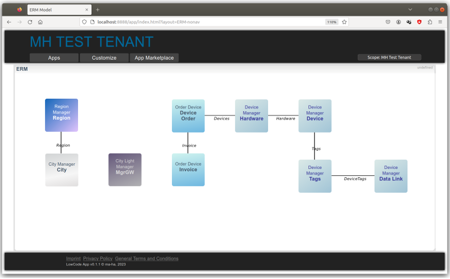

# Prototype of a "Low Code Data App".

## General Idea

It starts with a generic, secure **web gui**.

**Entities** can be **defined on-the-fly**, as well as their relationship.
Web forms and lists are generated to maintain data (documents) of this entities.

All data, users and authorizations are within **hierarchical scopes** (like tenants).
Entity definitions and data can be inherited to lower hierarchy scopes.
A web gui user can switch the scope in the gui.

Entities are bundled in apps, so they can be exported and imported via a app marketplace. 
Apps are installed and can be customized within a scope.
Tags can also be used to assign apps to a scope.

To start process **adapters can subscribe to events**, e.g. data changes. 
Adapters use service credentials defined on a dedicated scope. 

All **operations are exposed as API**, e.g. for the adapters.

# Run it

    cd app
    npm i
    export NODE_ENV=all-local
    node app | node_modules/bunyan/bin/bunyan 

Open http://localhost:8888/app/index.html

Login with user `demo` and password `demo`

# Entity / Document Model

Data types (and their Web GUI mapping)
- `Strings` (simple input fields)
- `Number` (simple input fields)
- `Boolean`  (checkboxes)
- `Date` (date picker)
- `Select` with an option array (pull down of values)
- `DocMap` master-detail reference (link to  filtered docs)
- `SelectRef` to other entity  (pull down of ids)
- `MultiSelectRef` to other entity  (pull down of ids)
- `Metrics` link to a metrics (time series data) for this entity id
- `JSON` (Multi Line Edit)
- `Link`(simple input fields, will take placeholders)

So relations are
- **1:n** = `docMap`
- **n:1**= `selectRef`
- **n:m** = `multiSelectRef`

# Integration 

## APIs

Adapters and connectors can use ReST APIs,
see [API and Format Reference Docu](doc/README.md).

## Event Hub

Adapters can subscribe to data events, to start processes or sync the data with external systems.

## GUI Links

Entities can refer to external GUI Apps using links. Placeholders in the links are populated with the entity data.

# Customizing

The GUI framework is "easy-web-app" and the underlying api server is "express".

## Persistence

The persistence uses simple files and a memory cache. 
This is not recommended for production use.

I should be simple to replace the persistence with a document DB. 
Simply rewrite:
- [app-dta.js](app/app-dta.js)
- [app-dta-user.js](app/app-dta-user.js)

## OpenID Connect

The implementation brings it's own OICD auth server.  

Have a look into the config files to configure a real OICD IAM.

The invitation process may need some additional OICD onboarding flow, 
if th users aren't already there.

## Web Content 

Some [static docertyu files](app/html/), GTC, imprint etc. need to be customized to your needs.

A simple markdown docu can be implemented, as well as a self-service onboarding, see [api-content.js](app/api-content.js).

## CSS

Simple color scheme changes can be done easily, just focus on the 1st 15 lines in [custom.css](app/css/custom.css) 

# TODOs

- [ ] MultiSelectRef field type
- [ ] Metrics field type
- [ ] Refactor ext. data API
- [ ] Refactor API for scopes
- [ ] Event filter
- [ ] Document delete function
- [ ] Entity JSON field type
- [ ] Scope meta data
